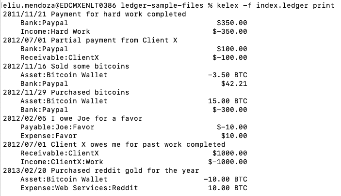
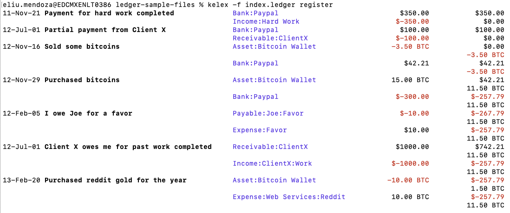
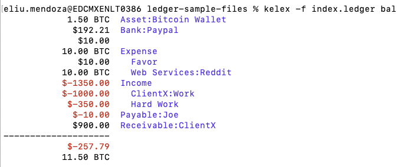

# CLI-Accounting-App
Simple implementation of the ledger-cli.

Made in Java, with picocli.
# How to Run (IMPORTANT!)
1. In the root dir, you'll find **CLI-Accounting-1.0-SNAPSHOT-all.jar**, you can keep it in any dir you want, but you'll need the path to it.
2. Create an alias in your terminal
   * Open your terminal or command line
   * Run the command 
   ```
   cd
   ```
   * Edit the .zshrc file, in this example, vim is used
    
    ```
   vi .zshrc
   ```

    (Create it if it doesn't exist already)    
   * Append to the bottom of this text file the next alias:
    
   ```
    alias kelex='java -jar /PATH_TO_JAR/CLI-Accounting-1.0-SNAPSHOT-all.jar'
   ``` 
    ## **Replace _PATH_TO_JAR_ with the path to CLI-Accounting-1.0-SNAPSHOT-all.jar**
   * Back at the command line, use the source command to reload the shell profile configuration:
     
   ```
   source ~/.zshrc
    ```
   * The alias is ready to be used!
3. You can now run the commands print, balance and register, like this:

    Print:
    ```
   kelex -f index.ledger print
   ```

   Balance:
    ```
    kelex -f index.ledger balance
   ```

   Register:
    ```
    kelex -f index.ledger register
    ```

# Examples




